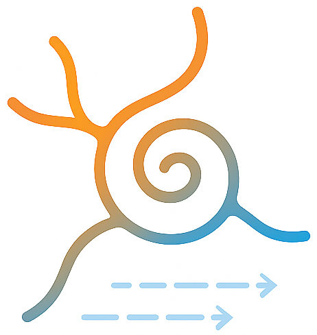

#  napari-FlowReg

This repository contains the napari wrapper for the Flow-Registration toolbox, which is a toolbox for the compensation and stabilization of multichannel microscopy videos. 
The publication for this toolbox can be found [here](https://doi.org/10.1002/jbio.202100330) and the project website with video results [here](https://www.snnu.uni-saarland.de/flow-registration/).

**Related projects**
- PyFlowReg: https://github.com/FlowRegSuite/pyflowreg
- Original Flow-Registration repo: https://github.com/FlowRegSuite/flow_registration
- ImageJ/Fiji plugin: https://github.com/FlowRegSuite/flow_registration_IJ
- MCP tools for LLM workflows: https://github.com/FlowRegSuite/pyflowreg-mcp


## Installation via pip and conda

To install the plugin via conda, you can create a new environment and install `napari` along with the plugin:

    conda create -n flowreg -c conda-forge python=3.12.0 napari

You can then install `napari-flowreg` via [pip]:

    pip install napari-flowreg

or from the directly from the GitHub repository:

    pip install git+https://github.com/flowregsuite/napari-flowreg.git


## Dataset

The dataset which we used for our evaluations is available as [2-Photon Movies with Motion Artifacts](https://www.datadryad.org).

## Citation

Details on the method and video results can be found [here](https://www.snnu.uni-saarland.de/flow-registration/).

If you use parts of this code or the plugin for your work, please cite

> P. Flotho, S. Nomura, M. Flotho, A. Keller and B. Kuhn, “Pyflowreg: A python package for high accuracy motion correction of 2P microscopy videos and 3D scans,” arxiv, 2024. [doi:https://]()

BibTeX entry
```
@article{flotea2025g,
    author = {Flotho, P. and Nomura, S. and Flotho, M. and Keller, A. and Kuhn, B.},
    title = {Pyflowreg: A python package for high accuracy motion correction of 2P microscopy videos and 3D scans},
    year = {2022},
  journal = {arxiv},
  doi = {https://doi.org/}
}
```

and 

> P. Flotho, S. Nomura, B. Kuhn and D. J. Strauss, “Software for Non-Parametric Image Registration of 2-Photon Imaging Data,” J Biophotonics, 2022. [doi:https://doi.org/10.1002/jbio.202100330](https://doi.org/10.1002/jbio.202100330)

BibTeX entry
```
@article{flotea2022a,
    author = {Flotho, P. and Nomura, S. and Kuhn, B. and Strauss, D. J.},
    title = {Software for Non-Parametric Image Registration of 2-Photon Imaging Data},
    year = {2022},
  journal = {J Biophotonics},
  doi = {https://doi.org/10.1002/jbio.202100330}
}
```